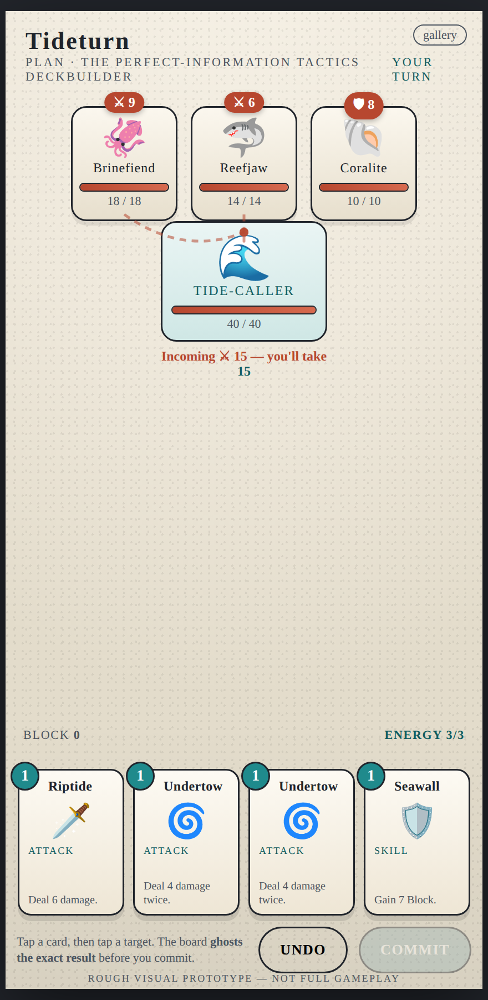
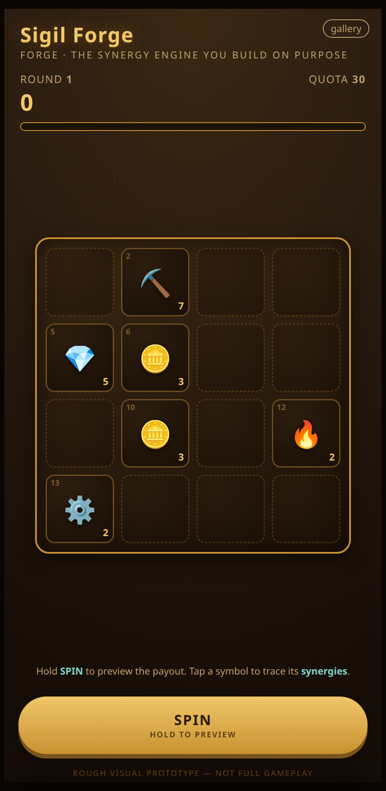
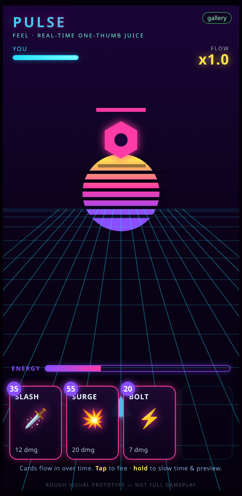
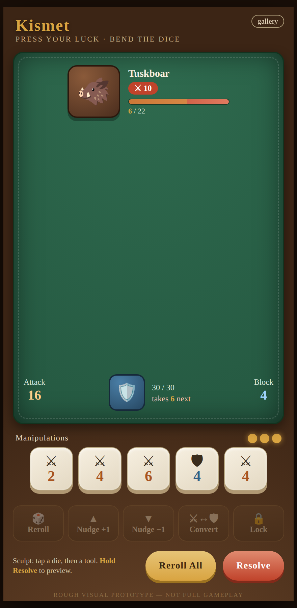

# Deckbuilder game ideas

Four **radically different** takes on the "deck/engine builder" genre, plus the shared design
thinking behind them. Each concept is a distinct core verb — not a reskin of the others — and
each is scored against a shared set of pillars distilled from notes on the games that inspired
this project (Slay the Spire, Balatro, Luck be a Landlord, Slice & Dice, Dice of Kalma).

## Start here

- **[00 · Design Principles](./00-design-principles.md)** — the lessons pulled from each
  inspiration and the seven pillars every concept honors. Read this first.

## The four concepts

| # | Concept | Core verb | The one-liner | Chiefly answers |
| --- | --- | --- | --- | --- |
| [01](./01-tideturn.md) | **Tideturn** | *Plan* | Perfect-information tactical card combat — see the whole turn before you commit. | StS depth · anti-guessing · targeting clarity |
| [02](./02-sigil-forge.md) | **Sigil Forge** | *Forge* | A synergy engine you deliberately craft — steer RNG toward the build you want. | Luck be a Landlord's "can't reach my build" |
| [03](./03-pulse.md) | **Pulse** | *Feel* | Real-time, shader-forward, one-thumb juice-fest. | Balatro-feel · Kalma one-handed play |
| [04](./04-kismet.md) | **Kismet** | *Press your luck* | Editable dice pool you bend, with a difficulty ceiling that bites. | Kalma's "too easy" · dice-combat done for mobile |

## How they differ at a glance

- **Substrate:** cards (01) · symbols/engine (02) · cards in real time (03) · editable dice (04)
- **Pace:** deliberate turns (01, 02) · real-time flow (03) · tactile turns (04)
- **Signature feature:** turn-staging preview (01) · the forge/steering toolkit (02) ·
  time-dilation aim (03) · the manipulation toolkit + ascension ceiling (04)
- **Primary risk:** does full info reduce tension (01) · does steering get too easy (02) ·
  phone performance & depth (03) · manipulation power creep (04)

## Shared foundations (why they can share a codebase)

All four share the same *constraints* rather than a fixed stack (see `00`): **deterministic,
seed-driven game logic kept separate from rendering**, a renderer with strong 2D/shader
capability for juice, and accessible touch UI — delivered mobile-first to iOS/Android (and
ideally web). The engine/framework is still an open decision. Deterministic logic is what makes
hold-to-preview, daily seeds, and async/leaderboard modes cheap across every concept.

## Visual prototypes

Each concept has a rough, self-contained visual prototype in
[`../prototypes/`](../prototypes/) — open [`prototypes/index.html`](../prototypes/index.html)
(phone or narrow window is best). They aren't full games; they just convey the *feel* of each
core loop:

- [`tideturn.html`](../prototypes/tideturn.html) — stage cards, watch the board ghost the result, commit.
- [`sigil-forge.html`](../prototypes/sigil-forge.html) — hold Spin to preview, chain symbols, draft toward a build.
- [`pulse.html`](../prototypes/pulse.html) — tap to fire / hold to slow time, build a flow multiplier.
- [`kismet.html`](../prototypes/kismet.html) — roll, then reroll/nudge/convert/lock the dice; hold Resolve to preview.

Screenshots (also in [`../prototypes/screenshots/`](../prototypes/screenshots/)):

| Tideturn | Sigil Forge | Pulse | Kismet |
| --- | --- | --- | --- |
|  |  |  |  |

## Suggested next step

Pick the concept whose *core verb* excites you most and build a **single-fight vertical slice**
that proves its signature feature and its juice — that's the fastest way to feel whether the
idea sings on an actual phone.
